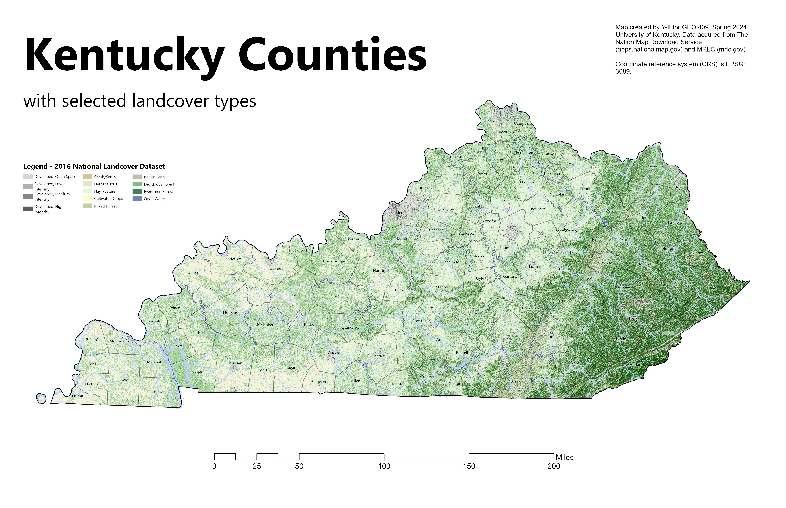
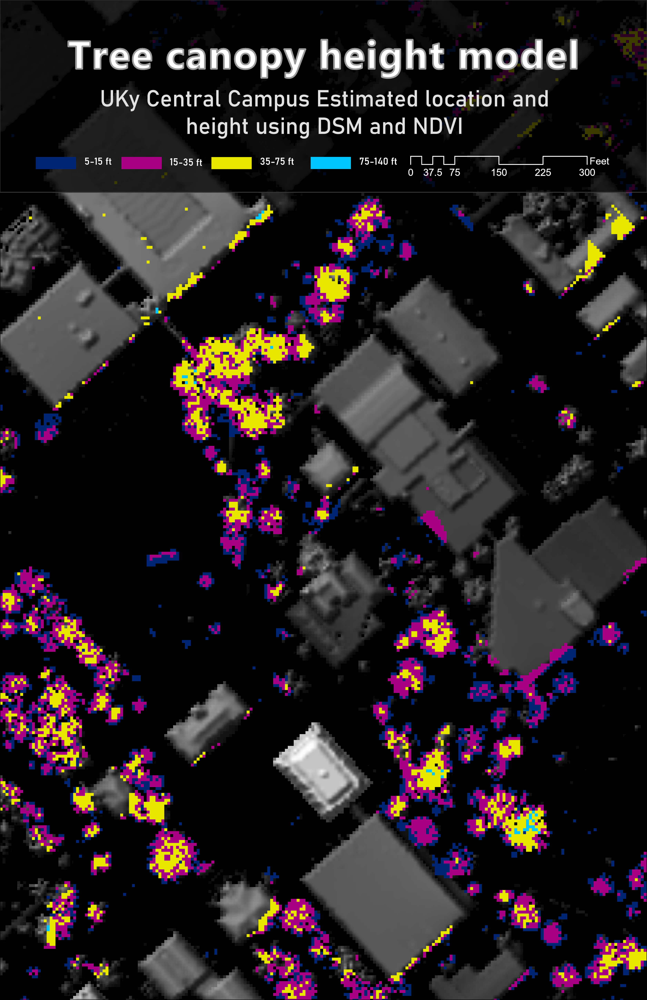

# geo409-field-trip

    [my first link] (https://github.com/Y-ItGIS/geo409-field-trip)

    
    Kentucky counties with selected land cover types -
    [Download geospatial PDF](Ky-landuse.pdf)

    
    UKy central campus canoly model - [Downlaod geosspatial PDF](campus-canopy-model.pdf)

    Maps created by Y-It for GEO409, Spring 2025, University of Kentucky Department of Geography